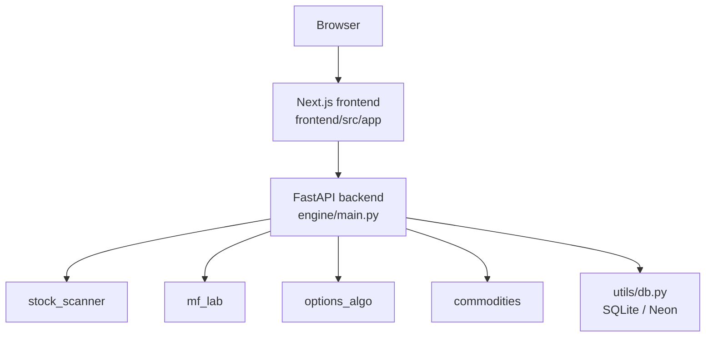

# Fortress 95 Pro

Fortress 95 Pro is a quantitative trading dashboard with a **Next.js frontend**
and a **FastAPI backend**. The current focus is the screener workflow, with
supporting modules for mutual funds, commodities, options, orders, profiles,
and scan history.

## What Lives Where

- `frontend/` - Next.js App Router UI
- `engine/` - FastAPI app and analysis modules
- `ui/` - legacy Streamlit-era UI code kept for reference and module reuse
- `tests/` - backend and frontend regression tests

## Current Architecture



## Key Features

- Stock screener with conviction scoring
- Mutual fund analysis and refresh jobs
- Options chain snapshot and strategy scan
- Commodities dashboard
- Orders, profile, and broker connection pages
- Scan history backed by the shared scan tables

## Local Setup

### 1. Backend

```bash
cd /Users/shivamdixit/Desktop/fortress-dashboard-main
source .venv/bin/activate
export FORTRESS_DB_BACKEND=sqlite
export FORTRESS_APP_PASSWORD=fortress123
uvicorn engine.main:app --host 0.0.0.0 --port 8000
```

### 2. Frontend

```bash
cd /Users/shivamdixit/Desktop/fortress-dashboard-main/frontend
npm install
npm run dev
```

Open:

- Frontend: `http://localhost:3000`
- Backend: `http://localhost:8000`

## Default Login

- Username: `admin`
- Password: `fortress123`

## Environment Variables

### Backend

- `FORTRESS_APP_USERNAME`
- `FORTRESS_APP_PASSWORD`
- `FORTRESS_DB_BACKEND`
- `DATABASE_URL`
- `NEON_CONNECTION_STRING`
- `FORTRESS_API_KEY`
- `FORTRESS_CORS_ORIGINS`

### Frontend

- `NEXT_PUBLIC_API_URL`
- `BACKEND_URL`

If `NEXT_PUBLIC_API_URL` is not set, the frontend defaults to
`http://localhost:8000` in local development.

## Testing

Run the frontend build:

```bash
cd frontend
npm run build
```

Run backend tests:

```bash
PYTHONPATH=.:engine .venv/bin/pytest -v
```

## Notes

- The Next.js app is the active UI.
- The legacy Streamlit code under `ui/` and `engine/legacy/` is preserved as
  reference material and for historical parity, but it is not the primary UI.
- The backend accepts authenticated requests via the `fortress_token` cookie
  and also supports API-key protected deployment mode.

