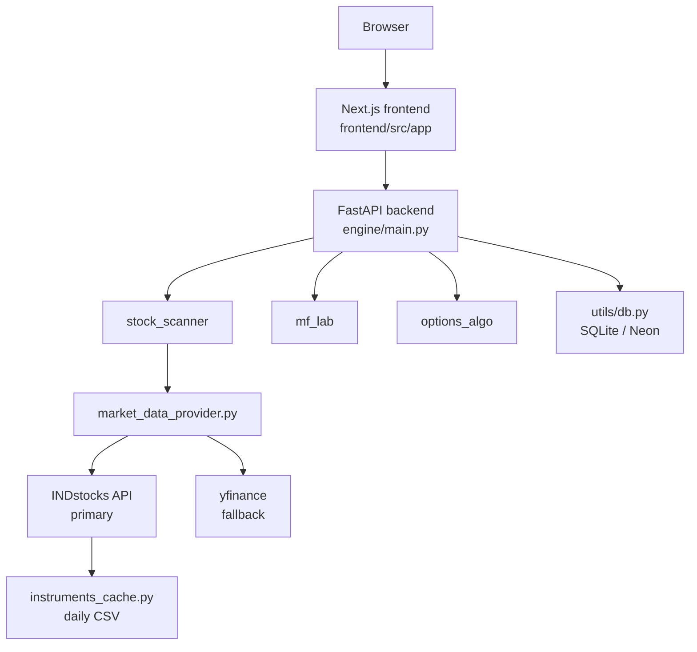

# Fortress 95 Pro

Quantitative trading dashboard for Indian markets (NSE focus).  
**Next.js 16 frontend + FastAPI backend.** The legacy Streamlit UI is preserved as reference only.

## What Lives Where

| Path | Purpose |
|---|---|
| `frontend/` | Next.js 16 App Router UI (active) |
| `engine/` | FastAPI app + all analysis modules |
| `engine/utils/market_data_provider.py` | **Single entry point for all price data** |
| `engine/utils/indstocks_client.py` | INDstocks REST client (rate-limited, TOTP auto-refresh) |
| `engine/utils/instruments_cache.py` | Daily NSE instruments CSV cache (symbol → security ID) |
| `engine/stock_scanner/` | Conviction scoring engine |
| `engine/routers/` | FastAPI routers serving the Next.js frontend |
| `engine/utils/db.py` | SQLite / Neon Postgres abstraction |
| `tests/` | Backend + frontend regression tests |
| `ui/` | Legacy Streamlit UI (reference only — do not expand) |
| `scripts/` | Utility scripts (token refresh, pick tracker, etc.) |

## Current Architecture



## Market Data Provider

All price data flows through `engine/utils/market_data_provider.py`:

| Call type | Provider |
|---|---|
| Single-symbol daily OHLCV | **INDstocks** → yfinance fallback |
| Close price series (benchmark, returns) | **INDstocks** → yfinance fallback |
| Batch multi-ticker download (`group_by="ticker"`) | yfinance (INDstocks has no equivalent) |
| Intraday intervals (5m, 1h, etc.) | yfinance |
| US stocks | yfinance (INDstocks is India-only) |

INDstocks activates automatically when any of these env vars are set:
- **TOTP (preferred):** `INDSTOCKS_CLIENT_ID` + `INDSTOCKS_MPIN` + `INDSTOCKS_TOTP_SECRET`
- **Static:** `INDSTOCKS_TOKEN` (expires every 24 h)

## Key Features

- Stock screener with conviction scoring (technical + fundamental + sentiment + context)
- Mutual fund analysis and refresh jobs
- Options chain snapshot and strategy scan
- Commodities dashboard
- Orders, profile, and broker connection pages
- Scan history backed by shared scan tables

## Local Setup

### 1. Backend

```bash
source .venv/bin/activate

# Database
export FORTRESS_DB_BACKEND=sqlite     # local SQLite; set DATABASE_URL for Neon

# INDstocks market data — TOTP auto-refresh (recommended)
export INDSTOCKS_CLIENT_ID=dX03OgVqr0Cgc8x7fJQ0
export INDSTOCKS_MPIN=<your_mpin>
export INDSTOCKS_TOTP_SECRET=<base32_setup_key>

# Optional auth
export FORTRESS_APP_PASSWORD=fortress123

uvicorn engine.main:app --host 0.0.0.0 --port 8000 --reload
```

Token is generated automatically at startup and refreshed on expiry. No manual copy-paste needed.

### 2. Frontend

```bash
cd frontend
npm install
npm run dev     # http://localhost:3000
```

### 3. Refresh INDstocks token manually (if using static token)

```bash
python3 scripts/refresh_indstocks_token.py --write-env
source .env.local
```

## Default Login

- Username: `admin`
- Password: `fortress123`

## Environment Variables

### Backend — Core

| Variable | Required | Default | Description |
|---|---|---|---|
| `FORTRESS_DB_BACKEND` | No | `neon` | `sqlite` or `neon` |
| `DATABASE_URL` | Neon only | — | Neon PostgreSQL connection string |
| `FORTRESS_APP_USERNAME` | No | `admin` | Login username |
| `FORTRESS_APP_PASSWORD` | **Yes (prod)** | `fortress123` | Login password |
| `FORTRESS_API_KEY` | No | — | API key for protected endpoints |
| `FORTRESS_CORS_ORIGINS` | No | — | Allowed CORS origins |

### Backend — Market Data (INDstocks)

| Variable | Required | Description |
|---|---|---|
| `INDSTOCKS_CLIENT_ID` | TOTP mode | Static client ID from dashboard |
| `INDSTOCKS_MPIN` | TOTP mode | Account MPIN |
| `INDSTOCKS_TOTP_SECRET` | TOTP mode | Base32 setup key from TOTP dashboard |
| `INDSTOCKS_TOKEN` | Static mode | Access token (expires 24 h) |

Set the TOTP trio for fully automatic token management. If none are set, market data falls back to yfinance.

### Frontend

| Variable | Description |
|---|---|
| `NEXT_PUBLIC_API_URL` | FastAPI base URL (defaults to `http://localhost:8000`) |
| `BACKEND_URL` | Server-side API URL |

## Testing

```bash
# Backend
PYTHONPATH=.:engine .venv/bin/pytest -v

# Frontend
cd frontend && npm run build
```

## Notes

- The Next.js app is the active UI. Do not add features to the Streamlit layer.
- All market data **must** go through `market_data_provider.py` — never import yfinance or `INDstocksClient` directly in routers or scanner logic.
- The backend accepts authenticated requests via the `fortress_token` cookie and API-key protected deployment mode.
